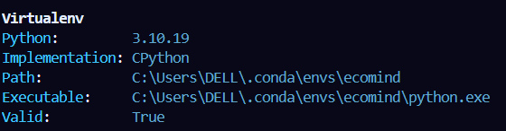

# EcoMind: AI Powered Environmental Health Monitoring System  


## Dev Instructions  

### Initial Set Up

Step 0:  
You may activate your conda env if you prefer.  

* ```conda create -n ecomind python=3.11.9```  
* ```conda activate ecomind```  
* ```conda config --add channels conda-forge```
* ```conda config --set channel_priority strict```

Step 1 (run these cmds **in you project directory**):

* ```pip install pipx```  
* ```pipx install poetry```  
* ```poetry install```  

Step 2 (Only if you use conda env):

* check python used by poetry with ```poetry env info``
* Ensure ```\.conda\envs\ecomind\``` in Path and Executable

* If you don't see ```.conda```, run ```where.exe python``` and copy path to your choosen conda env python.
* Now run ```poetry use <path/to/python.exe>``` and check ```poetry env info```.

_*Use ```poetry run python ecomind.py``` to run python files.*_

Now we are good to go.  

>**Note:**  
>
>* poetry checks for python version match (current ecomind uses python 3.11.9 or >=3.11). You can check in pyproject.toml  
>* If fails poetry automatically changes python path or shows error.

---
Keep your client library up to date by running the command for the package manager you used to install earthengine-api:  

* Conda Package Manager: ```conda update -c conda-forge earthengine-api```  
* Python Package Installer: ```pip install earthengine-api --upgrade```  
* Poetry: ```poetry update earthengine-api```  
